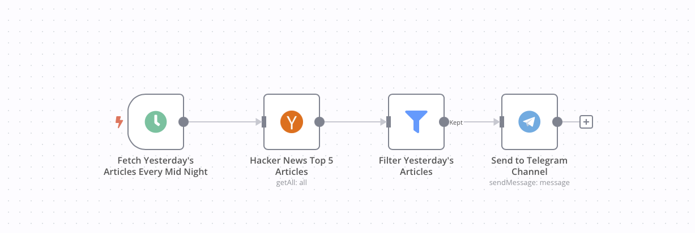

# Workflow Automation using N8N

# Installation

1. Clone repository
2. Install docker and docker compose by following this [instructions](https://docs.n8n.io/hosting/installation/server-setups/docker-compose/)
3. Build and Run the n8n using `docker compose up --build`
4. Access the app in [localhost:5679](http://localhost:5678)
5. Import the selected configuration file in `/app/n8n` directory from project root

# Workflows

## Hackernews Ruby on Rails Articles Fetcher

# References

- [n8n](https://n8n.io)
- [n8n docs](https://docs.n8n.io)
